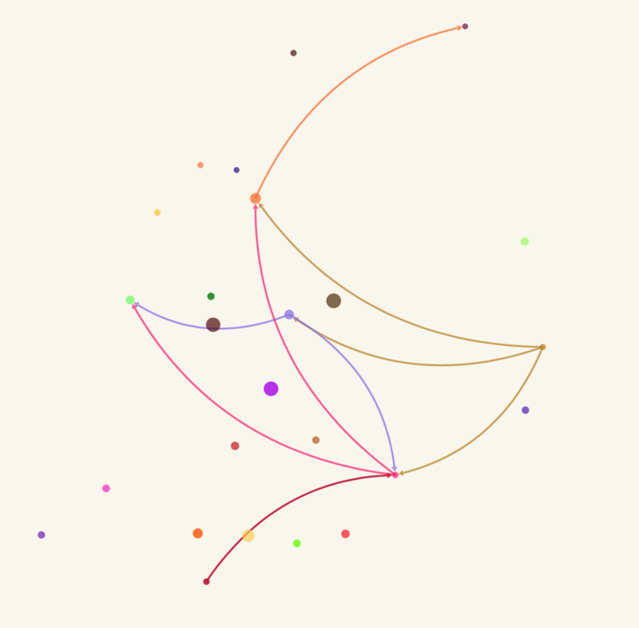
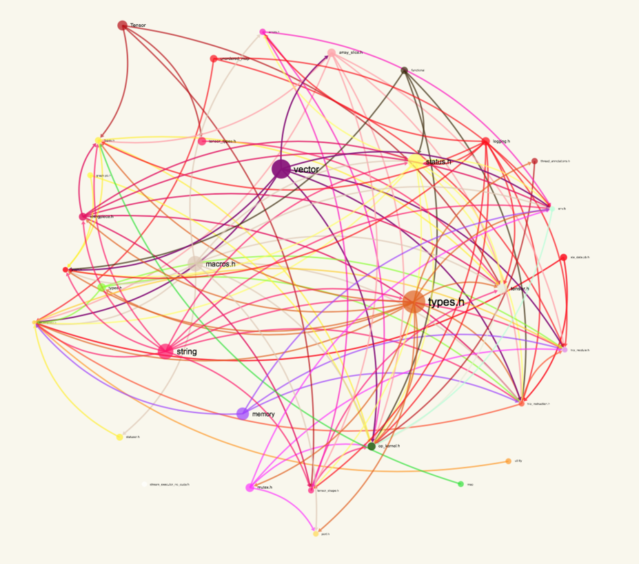
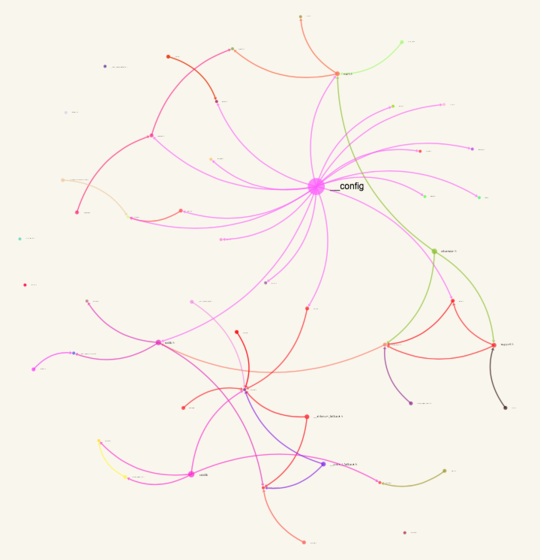

# :fireworks: ig

<p align="center">
  
  <br><br>
  <code>ig</code> is a tool to interactively visualize include graphs for C++ projects
  <br><br>
  
</p>

## Overview

Point `ig` at any directory containing C++ source or header files and it will
construct a full graph of all includes, serve you a local website and visualize
the graph interactively with [sigma.js](http://sigmajs.org), for you to admire.

Usage is very easy:

```sh
$ ig -o include
```

will inspect the folder `include`, serve a website on `localhost:8080` and even
open your browser for you. The full set of options currently include:

```sh
usage: ig [-h] [--pattern PATTERNS] [-i PREFIXES] [-v] [-p PORT] [-o] [-j]
          [-d DIRECTORY] [--relation {includes,included-by}]
          [--min-degree MIN_DEGREE] [--group-granularity GROUP_GRANULARITY]
          [--full-path] [--colors COLORS] [--color-variation COLOR_VARIATION]
          [--color-alpha-min COLOR_ALPHA_MIN]
          directories [directories ...]

Visualize C++ include graphs

positional arguments:
  directories           The directories to inspect

optional arguments:
  -h, --help            show this help message and exit
  --pattern PATTERNS    The file (glob) patterns to look for
  -i PREFIXES, -I PREFIXES, --prefix PREFIXES
                        An include path for headers to recognize
  -v, --verbose         Turn on verbose output
  -p PORT, --port PORT  The port to serve the visualization on
  -o, --open            Open the webpage immediately
  -j, --json            Print the graph JSON and instead of serving it
  -d DIRECTORY, --dir DIRECTORY
                        The directory to store the served files in. If not
                        supplied, a temporary directory is created.
  --relation {includes,included-by}
                        The relation of edges in the graph
  --min-degree MIN_DEGREE
                        The initial minimum degree nodes should have to be
                        displayed
  --group-granularity GROUP_GRANULARITY
                        How coarse to group nodes (by folder)
  --full-path           If set, shows the full path for nodes
  --colors COLORS       The base RGB colors separated by commas
  --color-variation COLOR_VARIATION
                        The variation in RGB around the base colors
  --color-alpha-min COLOR_ALPHA_MIN
                        The minimum alpha value for colors
```

But does it scale? It scales quite well. The graph you see above is the include
graph for the entire LLVM and clang codebase, which spans more than 5,000 files
and 1.5M LOC. Note that the visualization also includes sliders to group nodes
by folder and filter out low-degree nodes.

## Installation

Get it with pip:

```sh
$ pip install ig-cpp
```

Works with Python 2 and 3.

## Examples

Who ever said C++ was an ugly language?

<p align="center">
  
  <br><br>
  <b>LLVM/ADT</b>
  <br><br>
</p>

<p align="center">
  
  <br><br>
  <b>TensorFlow</b>
  <br><br>
</p>

<p align="center">
  
  <br><br>
  <b>libc++ (the standard library)</b>
  <br><br>
</p>

## Authors

[Peter Goldsborough](http://goldsborough.me) + [cat](https://goo.gl/IpUmJn)
:heart:
